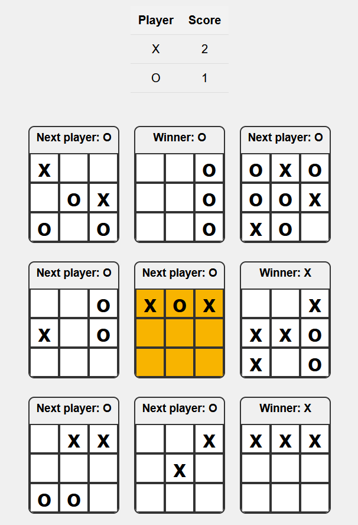

# Tic Tac Toes



<br>

Inspired by [VSauce](https://www.youtube.com/shorts/_Na3a1ZrX7c)

## Description

Tic Tac Toes is the classic Tic Tac Toe game with a twist. Instead of a single 3x3 board, there are 9 boards arranged in a 3x3 grid. Players take turns marking spaces in these boards, aiming to win individual boards and ultimately achieve the highest total score.

The game follows the following rules:

- Each player plays on one board during their turn.
- The next player must play on the board that matches the position of the square the previous player filled.
- If the next board is finished, the player can choose any available board to play on.
- Once all boards are finished, the player with the most wins is the total winner, or it's a draw if both players have the same number of wins.
- The first move can be played on any board.

## PWA Installation

The game is available as a [PWA](https://developer.mozilla.org/en-US/docs/Web/Progressive_web_apps/Guides/What_is_a_progressive_web_app).

You can install it as an app on your device from the browser like [this](https://developer.mozilla.org/en-US/docs/Web/Progressive_web_apps/Guides/Installing).

## Local Installation

To run the project locally, follow these steps:

1. **Clone the repository:**

   ```bash
   git clone https://github.com/iByteABit256/tic-tac-toes.git

   ```

2. **Navigate to the project directory:**

   ```bash
   cd tic-tac-toes

   ```

3. **Install dependencies:**

   ```bash
   npm install

   ```

4. **Launch the application:**

   ```bash
   npm start

   ```

5. **Open your web browser and visit http://localhost:3000 to play the game.**

## Contributing

Contributions are welcome! If you'd like to contribute to the project, please follow these steps:

1. Fork the repository.
2. Create a new branch for your feature or bug fix: `git checkout -b feature-name`.
3. Make your changes and commit them: `git commit -am 'Add new feature'`.
4. Push to your forked repository: `git push origin feature-name`.
5. Submit a pull request detailing your changes.

Please ensure that your contributions adhere to the GNU AGPL v3 license and follow the code of conduct.

## License

This project is licensed under the GNU Affero General Public License v3.0. See the [LICENSE](LICENSE) file for details.

## Credits

### Free Icons
- <a href="https://www.flaticon.com/free-icons/home-button" title="home button icons">Home button icons created by Freepik - Flaticon</a>
- <a href="https://www.flaticon.com/free-icons/mute" title="mute icons">Mute icons created by pictranoosa - Flaticon</a>
- <a href="https://www.flaticon.com/free-icons/speaker" title="speaker icons">Speaker icons created by Pixel perfect - Flaticon</a>
